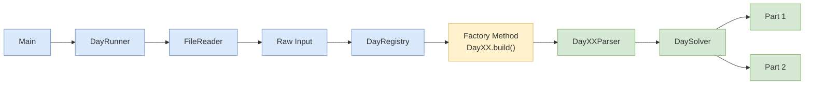

# 🎄 Advent of Code 2025

> Aplicación desarrollada en Java para la resolución de los retos de Advent of Code 2025 siguiendo principios de Ingeniería del Software, programación orientada a objetos y una arquitectura modular basada en patrones de diseño y buenas prácticas.

---

## 📖 Descripción

Este proyecto recoge las soluciones a los problemas de **Advent of Code 2025**, pero su objetivo va más allá de la resolución algorítmica.

Se ha diseñado como un sistema extensible y mantenible, aplicando conceptos estudiados en **Ingeniería del Software II**, tales como:

- Programación orientada a objetos.
- Separación de responsabilidades.
- Principios SOLID.
- Patrones de diseño.
- Encapsulación y modularidad.
- Bajo acoplamiento y alta cohesión.
- Programación orientada a interfaces.

---

## 🏗 Arquitectura del proyecto

La estructura del proyecto se organiza por días, manteniendo una arquitectura homogénea.

```text
/aoc
│
├── /core
│     ├── DaySolver
│     └── Inputparser
│
├── /days
│     │
│     ├── /day01
│     │      ├── /model
│     │            ├── ...
│     │      ├── Day01
│     │      └── Day01Parser
│     │
│     ├── /day02
│     │      ├── /model
│     │             ├── ...
│     │      ├── Day01
│     │      └── Day01Parser
│     │
│     ├── ...
│
└── DayRegistry
└── DayRunner
└── Main

```

Cada módulo contiene exclusivamente la lógica correspondiente a su problema, evitando dependencias innecesarias con el resto del sistema.

---

## 🎯 Objetivos del diseño

La arquitectura persigue los siguientes objetivos:

- Facilitar el mantenimiento.
- Minimizar el acoplamiento entre componentes.
- Favorecer la reutilización.
- Permitir la incorporación de nuevos problemas sin modificar código existente.
- Conseguir una estructura escalable.
- Facilitar la legibilidad y comprensión del código.

---

## ⚙ Flujo de ejecución

El proceso general de ejecución sigue las siguientes etapas:




La aplicación es capaz de seleccionar dinámicamente la implementación adecuada según el día solicitado.

---

## 📐 Principios SOLID aplicados

### Single Responsibility Principle (SRP)

> Una clase debe tener una única razón para cambiar.

#### Aplicación

Las responsabilidades se encuentran claramente separadas:

| Componente | Responsabilidad |
|------------|----------------|
| FileReader | Leer archivos |
| InputParser | Modelar la entrada |
| DaySolver | Resolver el problema |
| DayRegistry | Registro de soluciones |
| DayXX | Solver  |

#### Ejemplo

```java
public interface FileReader {
    String read(String route);
}
```

```java
public interface InputParser<T> {
    T parse(String rawInput);
}
```

```java
public interface DaySolver {
    Object solvePart1();
    Object solvePart2();
}
```

#### Beneficios

✅ Mayor mantenibilidad.

✅ Clases pequeñas y comprensibles.

✅ Menor propagación de cambios.

---

### Open/Closed Principle (OCP)

> El software debe estar abierto a extensión y cerrado a modificación.

#### Aplicación

Para añadir un nuevo día únicamente es necesario:

1. Crear la clase `DayXX`.
2. Crear su parser.
3. Registrarlo en la propia clase.

Sin modificar el resto del sistema.

#### Ejemplo

```java
static {
    DayRegistry.register(1, Day01::build);
}
```

Posteriormente:

```java
DaySolver solver = DayRegistry.create(day, input);
```

#### Beneficios

✅ Escalabilidad.

✅ Menor riesgo de introducir errores.

✅ Sistema fácilmente ampliable.

---

### Dependency Inversion Principle (DIP)

> Los módulos deben depender de abstracciones y no de implementaciones concretas.

#### Aplicación

Se trabaja mediante interfaces:

```java
DaySolver
InputParser<T>
FileReader
```

Por ejemplo:

```java
private static final FileReader reader = new TXTFileReader();
```

Podría sustituirse por:

```java
JSONFileReader
DatabaseReader
CSVFileReader
```

sin afectar al resto del sistema.

#### Beneficios

✅ Desacoplamiento.

✅ Facilidad para pruebas.

✅ Mayor flexibilidad.

---

## 🎨 Patrones de diseño utilizados

### Factory Method

#### Problema

La creación de cada solución no debería depender del cliente.

#### Solución

Cada día proporciona un método de construcción:

```java
public static DaySolver build(String input) {
    return new Day01(new Day01Parser().parse(input));
}
```

El cliente simplemente solicita:

```java
DaySolver solver = DayRegistry.create(day,input);
```

sin conocer qué clase concreta se instancia.

#### Beneficios

- Desacoplamiento.
- Extensibilidad.
- Centralización de la creación.

---

### Registry Pattern

#### Problema

Es necesario disponer de una forma de localizar dinámicamente las soluciones disponibles.

#### Implementación

```java
private static final Map<Integer, Function<String, DaySolver>> DAYS = new HashMap<>();
```

Registro:

```java
DayRegistry.register(1, Day01::build);
```

Obtención:

```java
DayRegistry.create(day,input);
```

#### Beneficios

- Registro centralizado.
- Eliminación de condicionales gigantes.
- Fácil incorporación de nuevos módulos.

---

### Strategy Pattern

#### Problema

Cada día implementa un algoritmo completamente diferente.

#### Solución

Todos los algoritmos implementan:

```java
public interface DaySolver {
    Object solvePart1();
    Object solvePart2();
}
```

Implementaciones:

```text
Day01
Day02
Day03
...
Day12
```

Cada una representa una estrategia distinta.

#### Ejemplo

```java
DaySolver solver = DayRegistry.create(day,input);

solver.solvePart1();
solver.solvePart2();
```

El código cliente es independiente del algoritmo concreto.

#### Beneficios

- Algoritmos intercambiables.
- Bajo acoplamiento.
- Extensibilidad.

---

## 🧠 Principios de diseño

Además de SOLID y patrones de diseño, el proyecto sigue una serie de principios arquitectónicos fundamentales que guían toda la estructura del sistema.

---

### 🔹 Separation of Concerns (SoC)

Cada componente tiene una responsabilidad bien definida:

- `FileReader` → lectura de entrada
- `Parser` → transformación de datos
- `DaySolver` → lógica del problema
- `Registry` → resolución dinámica de implementaciones

👉 Esto evita mezclar IO, parsing y lógica de negocio.

---

### Composition over Inheritance

#### Idea

Se favorece la composición frente a las jerarquías complejas de herencia.

#### Ejemplo

```java
new Day01(new Day01Parser().parse(input));
```

La clase utiliza otros objetos en lugar de extender una jerarquía profunda.

#### Beneficios

- Mayor flexibilidad.
- Menor acoplamiento.
- Reutilización.

---

### 🧩 Programación orientada a interfaces

Las principales dependencias se expresan mediante interfaces:

```java
FileReader
InputParser<T>
DaySolver
```

Esto permite sustituir implementaciones sin afectar al resto del sistema.

#### Ejemplo

```java
FileReader reader = new TXTFileReader();
```

Podría reemplazarse por:

```java
FileReader reader = new JSONFileReader();
```

sin modificar ningún cliente.

---

### 🔒 Encapsulación

Las estructuras internas permanecen ocultas:

```java
private final List<Rotation> rotations;
```

La interacción se realiza únicamente mediante métodos públicos.

#### Beneficios

- Protección del estado interno.
- Mayor robustez.
- Menor dependencia entre componentes.

---

### 🔗 Bajo acoplamiento

Los distintos días son independientes entre sí.

La única dependencia común es:

```java
DaySolver
```

Ninguna solución conoce las implementaciones de las demás.

---

### 📌 Alta cohesión

Cada paquete agrupa componentes relacionados:

```text
day08
│
├── Day08
├── Day08Parser
└── model
```

Toda la lógica asociada al problema permanece localizada en un único módulo.

---

### 🚀 Escalabilidad

Añadir un nuevo problema requiere únicamente:

```text
day13
│
├── Day13
├── Day13Parser
└── model
```

y registrarlo:

```java
static{
    DayRegistry.register(26, Day26::build);
}
```

No es necesario modificar el resto del sistema.

---

## 📊 Calidad del software

La arquitectura persigue los atributos de calidad definidos en Ingeniería del Software:

| Atributo | Aplicación |
|-----------|------------|
| Mantenibilidad | Código modular |
| Escalabilidad | Nuevos días sin modificaciones |
| Reutilización | Interfaces y componentes comunes |
| Flexibilidad | Dependencias sobre abstracciones |
| Cohesión | Responsabilidades agrupadas |
| Bajo acoplamiento | Componentes independientes |
| Legibilidad | Estructura homogénea |
| Robustez | Encapsulación y separación de responsabilidades |

---

## 💻 Tecnologías

- Java
- Programación Orientada a Objetos
- SOLID
- Patrones de Diseño
- Colecciones Java
- Expresiones Lambda
- Functional Interfaces

---

## 🎓 Objetivo académico

Este proyecto constituye un ejemplo práctico de aplicación de conceptos de Ingeniería del Software II, demostrando cómo diseñar un sistema modular, extensible y mantenible mediante principios de diseño orientados a objetos y patrones de diseño clásicos.

Más allá de la resolución de problemas algorítmicos, el proyecto busca poner en práctica técnicas empleadas en el desarrollo profesional de software, priorizando la calidad del diseño y la evolución futura del sistema.
